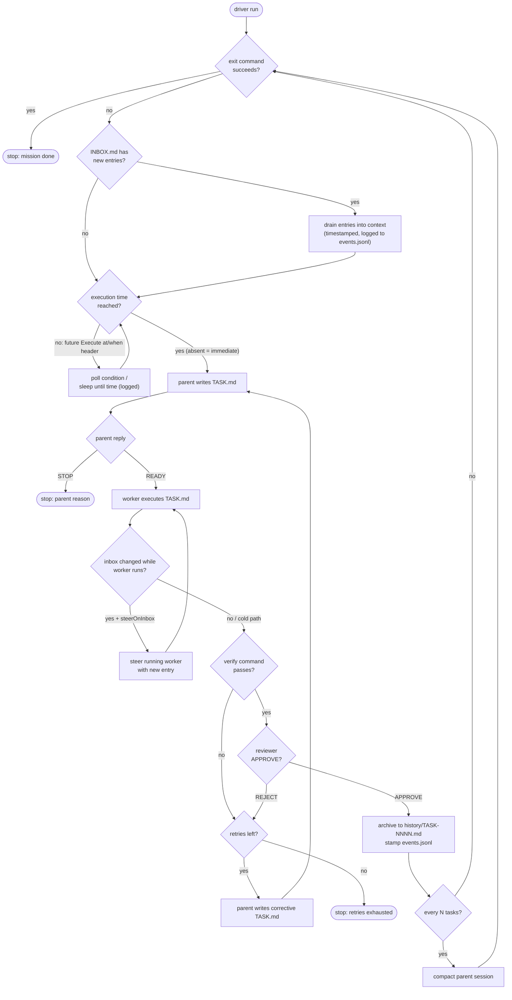

# plainloop — endless-loop mission driver for pi

Endless-loop driver: runs a mission as a chain of small pi sessions,
steered over pi's RPC protocol. The design lives in the
the [plainloop skill](skills/plainloop/SKILL.md); this directory is
the machinery.

## How it works

```
plainloop/driver.mjs (no LLM context)
  ├─ parent    one long-lived `pi --mode rpc` session (plainloop-parent-<mission>)
  │             writes TASK.md, diagnoses failures, compacted every N tasks
  ├─ worker    one `pi --mode rpc` session per task (plainloop-task-NNNN-<mission>)
  │             executes TASK.md; steered on timeout, aborted if it never settles
  └─ reviewer  one read-only `pi --mode rpc` session per task
  │             (plainloop-review-NNNN-<mission>)
                independent APPROVE/REJECT of the worker's result before archiving
```

All sessions are normal pi sessions — visible in pi-web and in
`~/.pi/agent/sessions/`.

## Inbox, scheduled execution, event log

### Flow



### Execution-time headers

`TASK.md` and `INBOX.md` entries accept an optional execution-time header.
**Absent = immediate** — the default when no header is present.

```text
Execute at: 2026-03-01T09:00:00+01:00                    # fixed time (ISO-8601)
Execute when: test -f done.flag && grep -q ok ci.log      # polled shell condition
```

The driver parks the loop (logged to `events.jsonl`) until the time is
reached or the condition succeeds, then continues. Precedence when several
sources declare a time: **inbox entry header → TASK.md header → `driver.json`
`wait` → immediate**.

### INBOX.md entry format

Writers append at any time — no timing required. Each entry is a block:

```markdown
## [2026-02-01T14:03:00+01:00] add tax rule
Execute at: 2026-03-01T09:00:00+01:00   # optional, absent = immediate
priority: steer                         # optional: steer | stop (hot path)

Body: what to add and where it belongs…
```

- **Cold path (default):** the driver drains new entries at the iteration
  boundary (after archive, before the next parent prompt) and folds them into
  the next TASK.md context.
- **Hot path (opt-in, `steerOnInbox: true`):** while the worker runs, a new
  entry triggers an RPC `steer` of the live worker session; `priority: stop`
  aborts instead.
- The driver records the last-drained timestamp so restarts never double-drain.

### Event log

`events.jsonl` in the mission dir: one `{ts, event, detail}` line per driver
action — task start/end, worker spawn/settle/timeout/retry, verify, review,
compact, inbox drain, wait begin/end. Append-only, machine-readable; gives
crash recovery, timing analysis, and an audit trail. `status` renders the
last N events.

## Install

The package is a standard pi package (extension + skill), so install it from
the repo with `pi install`:

```bash
# from GitHub
pi install git:github.com/breitlip/plainloop
pi install https://github.com/breitlip/plainloop   # raw URLs work too

# pin a ref
pi install git:github.com/breitlip/plainloop@v0.2.0

# or from a local checkout
pi install /path/to/plainloop
```

By default this writes to your user settings (`~/.pi/agent/settings.json`).
Use `-l` to install into project settings (`.pi/settings.json`) instead, or
`pi -e git:github.com/breitlip/plainloop` to try it for one run without
installing.

Verify with `pi list`, then restart pi (or start a new session) so the
`/plainloop` commands and the `plainloop` tool become available.

## Using from inside pi

The package ships a pi extension, so in any pi session (TUI, RPC, pi-web):

```text
/plainloop status [mission]                 # progress, liveness, log tail, work summary
/plainloop run <mission> [--max N] [--dry-run]
/plainloop stop [mission]
/plainloop list [mission]                   # the mission's pi sessions (open them in pi-web)
/plainloop version                          # installed extension version + install path
/plainloop help
```

`status` answers "is it actually running?" — driver pid liveness, the
current phase (`run — worker (task 3)` or `wait until … (remaining hh:mm:ss)`),
the last `driver.log` lines, the last `events.jsonl` events, plus a work
summary (latest completed task, CURRENT.md, STATE.md).

`list` shows every plainloop session for the mission (parent, task-NNNN,
review-NNNN) with last activity and size — they live in pi-web under the
session cwd (the repo root by default).

`version` is handy for checking what is actually loaded, since pi-web's
Settings → Pi packages panel only shows the source and install path, not
the version.

`run` starts the driver as a detached background process — the session stays
responsive and you get a notification when the run finishes. The driver also
writes `<mission>/.plainloop.pid`, so `stop` works even if the starting
session is gone.

There is also a `plainloop` tool, so you can simply ask the agent:
*"run the count mission for 20 iterations and tell me the result".*

## Usage (shell)

```bash
node driver.mjs run missions/count-to-1000 --max 5 --verbose
node driver.mjs status missions/count-to-1000
node driver.mjs run missions/<name> --dry-run   # show prompts, no pi
```

Flags:

- `--max N` — stop this run after N iterations (the mission itself keeps
  its own exit criteria)
- `--dry-run` — print the rendered prompts and checks, spawn nothing
- `--verbose` — echo the driver log to stdout

## Mission directory contract

```
<mission>/
├── MISSION.md    invariant: goal, constraints, exit criteria, protocol
├── STATE.md      durable state (sessions update per TASK.md)
├── TASK.md       current task brief (parent writes, worker executes)
├── CURRENT.md    worker scratch
├── INBOX.md      optional drop-in entries, drained by the driver each iteration
├── history/      completed briefs: TASK-0001.md, TASK-0002.md, ...
├── driver.json   driver contract (all keys optional)
├── events.jsonl  append-only timestamped driver event log
├── .plainloop.state.json  current phase (run/wait), cleared when the run ends
├── driver.log    append-only driver activity log
└── driver.err.log driver stderr (crash diagnostics) when started via the extension
```

### driver.json

| Key | Default | Meaning |
|---|---|---|
| `taskPrompt` | see driver | Prompt for the parent to write `TASK.md`. Parent replies `READY` or `STOP <reason>`. Template vars: `{{dir}} {{n}} {{count}} {{next}}` |
| `workerPrompt` | see driver | Prompt for the worker session. Same template vars |
| `verify` | `null` | Shell command (run in mission dir) that must succeed after each task. Template vars allowed. `null` = rely on the reviewer |
| `review` | `true` | Run an independent read-only reviewer session (APPROVE/REJECT) after verify, before archiving. Set `false` for cheap high-volume missions |
| `reviewTimeoutSec` | `120` | Reviewer run timeout |
| `exit` | `null` | Shell command (run in mission dir); success = mission done, loop stops |
| `wait` | `null` | Execution gate per iteration: `{"at":"2026-03-01T09:00:00+01:00"}` or `{"command":"test -f done.flag","intervalMs":30000,"timeoutMs":0}` (`timeoutMs` 0 = wait forever). Lower precedence than `Execute at/when` headers in INBOX.md entries or TASK.md |
| `countPattern` | `null` | Regex with one capture group, matched in STATE.md to derive `{{count}}` |
| `sessionCwd` | git root | cwd for the spawned pi sessions (pi keys sessions by cwd — defaulting to the repo root keeps them visible under the project in pi-web). Mission dir if no git root |
| `compactEvery` | `5` | Compact the parent session after every N completed tasks |
| `compactInstructions` | see driver | Focus instructions for the parent compaction |
| `parentTimeoutSec` | `180` | Parent run timeout (writing `TASK.md`) before the driver gives up |
| `workerTimeoutSec` | `240` | Worker run timeout before the driver steers it |
| `steerGraceSec` | `60` | Grace period after steering before aborting |
| `maxRetries` | `1` | Worker retries per task (each retry gets a parent-written corrective TASK.md) |
| `steerOnInbox` | `false` | Hot path: new INBOX.md entries while the worker runs steer the live worker session (`priority: stop` in an entry aborts it) |
| `inboxPollMs` | `5000` | Inbox poll interval while the worker runs (only used with `steerOnInbox`) |

## Failure handling

Per task, the driver runs: **worker → verify → review → archive**. Any of
the three checks failing consumes one retry:

1. Worker times out → driver sends a `steer` ("stop, finish the minimal
   STATE.md update") → grace period → `abort`.
2. Verify fails, or the reviewer replies `REJECT <reason>` → the parent
   inspects CURRENT.md/STATE.md (plus the failure reason) and writes a
   corrected, smaller TASK.md.
3. Retries exhausted (`maxRetries`) → driver stops with a clear line in
   `driver.log` and a non-zero exit code. Resume by fixing the files and
   running again — the loop is stateless; `history/` + STATE.md is the truth.

The reviewer is a fresh, **read-only** session (`--exclude-tools
bash,edit,write`) that judges the worker's claimed result against MISSION.md,
STATE.md, TASK.md and CURRENT.md. It cannot modify anything; it only replies
`APPROVE` or `REJECT <reason>`.

## Notes

- The driver splits stdout on `\n` only (LF framing per the RPC protocol);
  it never uses generic line readers.
- `PI_BIN` env var overrides the `pi` binary (default: `pi` on PATH).
- Parent/worker/reviewer session names are `plainloop-parent-<mission>` /
  `plainloop-task-NNNN-<mission>` / `plainloop-review-NNNN-<mission>` so
  they are easy to find in pi-web.
